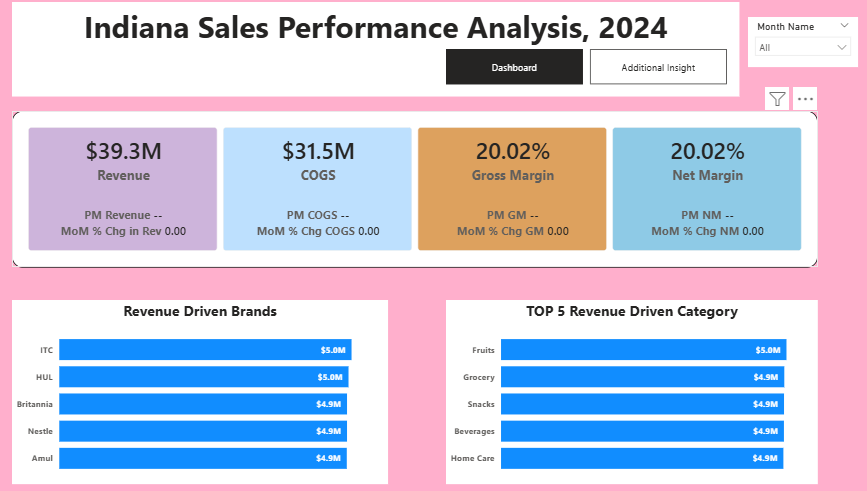
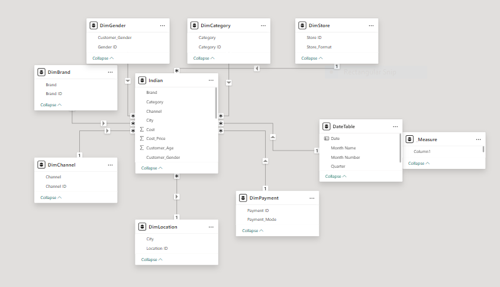

# Indiana Sales Performance Analysis, 2024.
## Indiana is a retail chain in India with multiple outlets across the country, generating high-frequency transaction data from various operational processes and customer touchpoints.

## Executive Summary
- Management requires a comprehensive view of overall business performance, spanning the total Revenue ,The Cost of Goods, the distribution of these goods across all channels, and the impact of brand performance on sales across all business units.
- Developed an interactive power BI which addresses the major concerns of the management to create different KPI cards  and provide other visuals to break down other findings  using the available dataset which contains over 100,000 rows and 21 columns.
- Delivered a centralized, data-driven reporting solution which shows that the business has made a total revenue of  $39.3M while a COGS of $31.5M .
## The Business Problem
Indiana Management is interested in going beyond raw sales figures by leveraging critical KPIs and visual insights to support data-driven decision-making, enabling sustainable growth and long-term business success.
### Key Questions Addressed:
- How have Key Performance Indicators (KPIs) changed MoM?
- Which product categories and regions are leading?
- Which brands generated the most revenue?
## The Process (Methodology)
### Tools Used:
Power BI, Power Query, DAX
### Data Sourcing & Overview
The dataset consists of approximately 100,000 transactions with 21 columns, covering operations across all current regions.
### Data Cleaning & Transformation (ETL)
Using Power Query, the raw data was transformed to ensure accuracy:
- Removed duplicate entries from the dataset.
- Created a date table
- Removed all the nulls

## Analysis & Insights
This section breaks down the data into actionable stories.
### The KPI Cards
The business generated a total revenue of $39.3M from all transactional activities during the year under review. Correspondingly, Cost of Goods Sold (COGS) amounted to $31.5M, resulting in both Gross Margin and Net Margin standing at 20.02% for the year.
In terms of monthly performance, revenue declined by 6.67% in February compared to January, but rebounded in March with a 6.67% increase. Similarly, COGS decreased by 6.93% in February relative to January, followed by a notable increase of 7.01% in March compared to February.
### Revenue Driven By Brands
The business’s revenue was largely driven by contributions from key brands, with ITC and HUL each generating $5M, followed by Britannia, Nestlé, and Amul at $4.9M each. These five brands represent the top sources of income for the business.
### Top 5 Revenue Driven Category
Fruits generated $5M in revenue, while Grocery, Snacks, Beverages, and Home Care each contributed $4.5M during the period under review, making them the top five revenue-generating categories.
### Impact of Channels on Revenue
The business operates across three primary sales channels: Omnichannel, Online, and Offline. Omnichannel leads with $13.2M in revenue, accounting for 33.46% of total sales. This is followed closely by Online, which generated $13.1M (33.35%), while Offline ranks third with $13.1M, contributing 33.19%. 

## Recommendations
- ### Strengthen Omnichannel Strategy
 Invest further in omnichannel capabilities (e.g., click-and-collect, real-time inventory visibility) to capitalize on its leading   position and enhance customer experience.
- ### Mitigate Brand Dependency Risk
 Expand partnerships and promote mid-tier or emerging brands to reduce over-reliance on the top 5 contributors and improve revenue resilience.
 - ### Leverage Seasonal Trends
 Investigate the February dip to identify root causes (e.g., demand cycles, promotions, supply issues) and implement targeted campaigns to stabilize performance during low periods.
- ### Optimize High-Performing Categories
 Double down on Fruits and other top categories through better supply chain efficiency, pricing strategies, and promotional activities to maximize returns.
 - ### Enhance Data-Driven Decision Making
Continue building dashboards with actionable KPIs (e.g., sales per channel, category growth rate, customer purchase behavior) to support faster and more informed management decisions.
- ### Channel-Specific Strategy Optimization
 Although balanced, each channel should have tailored strategies—e.g., personalized marketing for Online, in-store experience improvement for Offline, and seamless integration for Omnichannel.
 ## Link
 [Interactive Power BI Link](https://app.powerbi.com/view?r=eyJrIjoiMDJhNmRlMTYtNmRhMC00M2UwLTlmMzUtNzYwMGJmMWE5ODEzIiwidCI6IjY0M2NkODIwLWU2YzYtNGI2ZC05ZDc5LTJjOTgwOTllMTg3MCJ9)

